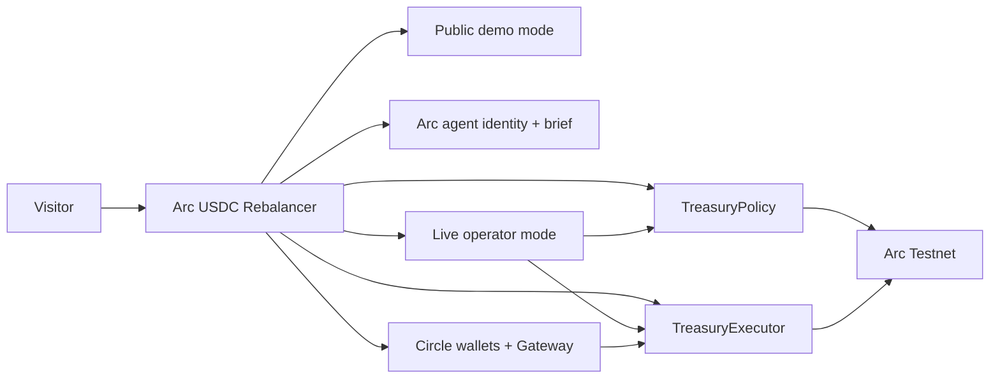

# Arc USDC Rebalancer

Public Arc Testnet treasury demo with a live agent, Circle wallets/Gateway readiness, and operator-gated execution.

Live demo: [https://web-eight-chi-99.vercel.app/dashboard](https://web-eight-chi-99.vercel.app/dashboard)  
Repo: [sin199/arc-usdc-rebalancer](https://github.com/sin199/arc-usdc-rebalancer)

## What this repo shows

- A public demo mode that visitors can use without a wallet.
- A live operator mode for signed Arc Testnet actions.
- A treasury policy and executor flow on Arc Testnet.
- An Arc agent identity and brief surfaced inside the dashboard.
- Circle developer-controlled wallet and Gateway readiness for USDC routing.
- A single dashboard that ties the agent, policy, wallet layer, and execution rail together.

## Why this exists

The repo is built to show a concrete Arc-native workflow:

1. Read the live TreasuryPolicy state on Arc Testnet.
2. Preview and simulate treasury scenarios in public demo mode.
3. Surface agent identity and a brief that recommends the next action.
4. Switch to live operator mode only when a signed onchain action is needed.
5. Keep Circle wallets and Gateway visible as part of the same USDC stack.

## Arc surface

The dashboard currently exposes these Arc-specific surfaces:

- Arc Testnet chain state and RPC
- TreasuryPolicy reads and owner-gated updates
- TreasuryExecutor for USDC movement
- Arc agent identity, validation, and operational brief
- Circle control plane for wallets and Gateway
- Public demo mode for unauthenticated visitors
- Live operator mode for signed execution

## Architecture



## Repo layout

- `apps/web` - Next.js dashboard and API routes.
- `packages/contracts` - Solidity contracts and Foundry scripts.
- `packages/shared` - Arc, Circle, policy, and execution helpers.

## Quick start

Install dependencies from the repository root:

```bash
pnpm install
```

Run the frontend:

```bash
pnpm --filter @arc-usdc-rebalancer/web dev
```

Open:

- `http://localhost:3000`
- `http://localhost:3000/dashboard`

## Arc Testnet details

- Chain ID: `5042002`
- RPC: `https://rpc.testnet.arc.network`
- Explorer: `https://testnet.arcscan.app`
- Native currency: `USDC`
- USDC token address used by the app: `0x3600000000000000000000000000000000000000`

## Environment variables

### Frontend runtime

Copy `apps/web/.env.example` to `apps/web/.env.local` and set:

- `ARC_TESTNET_RPC_URL` - Arc Testnet RPC endpoint used by the frontend
- `TREASURY_POLICY_ADDRESS` - deployed `TreasuryPolicy` contract address
- `TREASURY_EXECUTOR_ADDRESS` - deployed `TreasuryExecutor` contract address
- `NEXT_PUBLIC_CIRCLE_WALLET_SET_ID` - optional wallet set to surface in the dashboard
- `CIRCLE_API_KEY` - Circle developer API key for server-side wallet operations
- `CIRCLE_ENTITY_SECRET` - Circle entity secret for dev-controlled wallet creation and signing
- `CIRCLE_WALLET_SET_ID` - optional Circle wallet set to reuse for live wallet listing
- `CIRCLE_WALLET_SET_NAME` - wallet set name used when the dashboard creates a new set
- `CIRCLE_WALLET_NAME` - wallet name used when the dashboard creates a new wallet
- `CIRCLE_WALLET_BLOCKCHAIN` - target blockchain for the created wallet, default `ARC-TESTNET`
- `CIRCLE_WALLET_ACCOUNT_TYPE` - `EOA` or `SCA`
- `CIRCLE_GATEWAY_API_BASE` - Gateway API base, default testnet endpoint
- `CIRCLE_GATEWAY_SOURCE_DOMAIN` - Gateway source domain, default `26` for Arc Testnet
- `CIRCLE_GATEWAY_DESTINATION_DOMAIN` - Gateway destination domain, default `6` for Base Sepolia
- `OWNER_PRIVATE_KEY` - Arc Testnet agent owner wallet key used by the activation route
- `VALIDATOR_PRIVATE_KEY` - Arc Testnet validator wallet key used by the activation route

### Contract deployment

Copy `packages/contracts/.env.example` to `packages/contracts/.env` and set:

- `ARC_TESTNET_RPC_URL`
- `PRIVATE_KEY`
- `MIN_THRESHOLD_USDC`
- `TARGET_BALANCE_USDC`
- `MAX_REBALANCE_AMOUNT_USDC`

## Circle bootstrap

If you need to create a fresh Circle developer secret and wallet set, run:

```bash
pnpm circle:bootstrap
```

The command generates a new entity secret, registers it with Circle, creates an Arc Testnet wallet set, and provisions one developer-controlled wallet.

## Deployment

Frontend deployment is Vercel-based and should use `apps/web` as the project root.

The contract package is separate and can be deployed independently from the frontend.

## Review path

If you are reviewing this repo as an Arc builder project, start here:

1. Open the live demo at [web-eight-chi-99.vercel.app/dashboard](https://web-eight-chi-99.vercel.app/dashboard).
2. Check the public demo mode and the live operator mode split.
3. Inspect the Arc agent panel and the brief output.
4. Review the Circle line for wallet and Gateway readiness.
5. Read the `TreasuryPolicy` and `TreasuryExecutor` sections.

## Notes

- The dashboard reads and writes the deployed contract on Arc Testnet only.
- Public visitors can explore the demo without a wallet.
- Live signing stays gated behind the operator wallet.
- The Circle line is the live control plane for wallets and Gateway, not a separate product.
- The Arc agent panel surfaces the onchain identity and validation state tied to this website.
- The brief panel turns the current state into a single recommended action.
