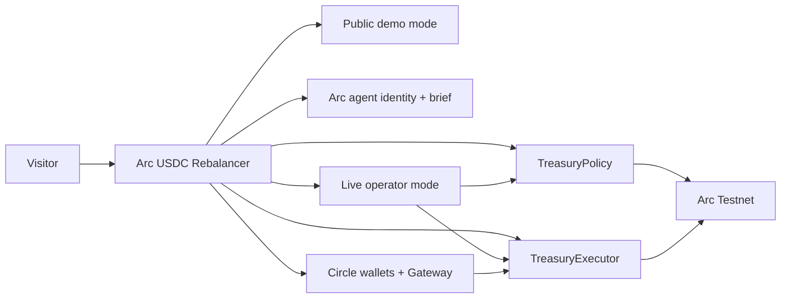

# Arc USDC Rebalancer

Readiness checker + operator brief + optional live execution for Arc Testnet treasury ops.

The public demo is report first, execution second: visitors can generate a readiness report without a wallet, compare sample treasury states, copy markdown or an action pack, and only move into operator mode when the operator wallet, live policy, Circle readiness, and executor dependencies are ready.

Live demo: [https://web-eight-chi-99.vercel.app/dashboard](https://web-eight-chi-99.vercel.app/dashboard)
Operator brief: [https://web-eight-chi-99.vercel.app/operator](https://web-eight-chi-99.vercel.app/operator)
Case study: [https://web-eight-chi-99.vercel.app/case-study](https://web-eight-chi-99.vercel.app/case-study)
Hackathon deck: [docs/arc-treasury-agent-deck.pptx](docs/arc-treasury-agent-deck.pptx)
Repo: [sin199/arc-usdc-rebalancer](https://github.com/sin199/arc-usdc-rebalancer)
Submission pack: [docs/arc-architects-submission.md](./docs/arc-architects-submission.md)

## What this repo shows

- A public demo mode that visitors can use without a wallet.
- A dedicated robot brief that explains what the installed agent does inside the project.
- A short case study page that explains what to inspect and how to replay the build.
- A copyable readiness report with policy, balance, Circle, wallet, executor, and agent evidence.
- A copyable action pack with exact commands and payload context for an operator to review.
- Live action controls that render only when operator wallet, live policy, Circle readiness, executor, and actionable report state are all ready.
- A self-healing live action path that can redeploy a fresh `TreasuryExecutor` if the saved one is stale, after the live gates are satisfied.
- A treasury policy and executor flow on Arc Testnet.
- An Arc agent identity and brief surfaced inside the dashboard.
- Circle developer-controlled wallet and Gateway readiness for USDC routing.
- A single dashboard that ties the agent, policy, wallet layer, and execution rail together.

## What it does not do

- It does not silently send transactions.
- It does not execute from preview mode.
- It does not execute without a live signer, Circle readiness, an operator wallet, a live policy snapshot, and an executor.
- It is not a profit bot.

## Why this exists

The repo is built to show how the installed robot is used inside this project:

1. Read or preview TreasuryPolicy state on Arc Testnet.
2. Preview and simulate treasury scenarios in public demo mode.
3. Surface the agent identity and the brief that recommends the next action.
4. Keep live operator execution gated until all live dependencies are ready.
5. Keep Circle wallets and Gateway visible as part of the same USDC stack.

## Project surface on Arc

The dashboard currently exposes these Arc-specific surfaces:

- Arc Testnet chain state and RPC
- TreasuryPolicy reads and owner-gated updates
- TreasuryExecutor for USDC movement
- Arc agent identity, validation, and operational brief
- Circle control plane for wallets and Gateway
- Public demo mode for unauthenticated visitors
- Live operator mode for signed execution after readiness gates pass

## Architecture


```mermaid
flowchart LR
  Visitor["Visitor"] --> UI["Arc USDC Rebalancer"]
  UI --> Demo["Public demo mode"]
  UI --> Agent["Arc agent identity + brief"]
  UI --> Policy["TreasuryPolicy"]
  UI --> Executor["TreasuryExecutor"]
  UI --> Circle["Circle wallets + Gateway"]
  UI --> Live["Live operator mode"]
  Live --> Policy
  Live --> Executor
  Circle --> Executor
  Policy --> Arc["Arc Testnet"]
  Executor --> Arc
```

## Repo layout

- `apps/web` - Next.js dashboard and API routes.
- `packages/contracts` - Solidity contracts and Foundry scripts.
- `packages/shared` - Arc, Circle, policy, and execution helpers.

## Quick start

Install dependencies from the repository root:

```bash
pnpm install
```

Run the frontend:

```bash
pnpm --filter @arc-usdc-rebalancer/web dev
```

Open:

- `http://localhost:3000`
- `http://localhost:3000/dashboard`
- `http://localhost:3000/case-study`

## Reproduce in 3 minutes

1. Open the homepage and confirm the 30-second visitor path: dashboard, readiness report, markdown/action pack, optional operator mode.
2. Open the dashboard and generate a readiness report from the current balance and policy inputs.
3. Switch between below minimum, at target, and above target to confirm `top_up`, `hold`, and `trim` outputs.
4. Copy the markdown report or the action pack in preview mode.
5. Confirm live action controls stay hidden until operator wallet, live policy, Circle readiness, executor, and actionable report state are all ready.

## Demo checklist

Use these screenshots to show the public flow without implying live execution:

1. Homepage hero with the 30-second visitor path.
2. Dashboard below minimum, showing a `top_up` readiness report.
3. Dashboard at target, showing a `hold` readiness report.
4. Dashboard above target, showing a `trim` readiness report.
5. Dashboard preview mode with `Execution locked until operator wallet and live dependencies are ready.`

## Reproduce locally in 1 minute

If you just want the app running locally, use the dashboard in preview mode:

```bash
pnpm install
pnpm --filter @arc-usdc-rebalancer/web dev
```

Then open `http://localhost:3000/case-study` first, followed by `http://localhost:3000/dashboard`.

## Arc Testnet details

- Chain ID: `5042002`
- RPC: `https://rpc.testnet.arc.network`
- Explorer: `https://testnet.arcscan.app`
- Native currency: `USDC`
- USDC token address used by the app: `0x3600000000000000000000000000000000000000`

## Environment variables

### Frontend runtime

Copy `apps/web/.env.example` to `apps/web/.env.local` and set:

- `ARC_TESTNET_RPC_URL` - Arc Testnet RPC endpoint used by the frontend
- `TREASURY_POLICY_ADDRESS` - deployed `TreasuryPolicy` contract address
- `TREASURY_EXECUTOR_ADDRESS` - deployed `TreasuryExecutor` contract address
- `NEXT_PUBLIC_EXECUTION_API_URL` - optional legacy robot API base for the job center surface
- `NEXT_PUBLIC_CIRCLE_WALLET_SET_ID` - optional wallet set to surface in the dashboard
- `CIRCLE_API_KEY` - Circle developer API key for server-side wallet operations
- `CIRCLE_ENTITY_SECRET` - Circle entity secret for dev-controlled wallet creation and signing
- `CIRCLE_WALLET_SET_ID` - optional Circle wallet set to reuse for live wallet listing
- `CIRCLE_WALLET_SET_NAME` - wallet set name used when the dashboard creates a new set
- `CIRCLE_WALLET_NAME` - wallet name used when the dashboard creates a new wallet
- `CIRCLE_WALLET_BLOCKCHAIN` - target blockchain for the created wallet, default `ARC-TESTNET`
- `CIRCLE_WALLET_ACCOUNT_TYPE` - `EOA` or `SCA`
- `CIRCLE_GATEWAY_API_BASE` - Gateway API base, default testnet endpoint
- `CIRCLE_GATEWAY_SOURCE_DOMAIN` - Gateway source domain, default `26` for Arc Testnet
- `CIRCLE_GATEWAY_DESTINATION_DOMAIN` - Gateway destination domain, default `6` for Base Sepolia
- `OWNER_PRIVATE_KEY` - Arc Testnet agent owner wallet key used by the activation route
- `VALIDATOR_PRIVATE_KEY` - Arc Testnet validator wallet key used by the activation route

### Contract deployment

Copy `packages/contracts/.env.example` to `packages/contracts/.env` and set:

- `ARC_TESTNET_RPC_URL`
- `PRIVATE_KEY`
- `MIN_THRESHOLD_USDC`
- `TARGET_BALANCE_USDC`
- `MAX_REBALANCE_AMOUNT_USDC`

## Circle bootstrap

If you need to create a fresh Circle developer secret and wallet set, run:

```bash
pnpm circle:bootstrap
```

The command generates a new entity secret, registers it with Circle, creates an Arc Testnet wallet set, and provisions one developer-controlled wallet.

## Deployment

Frontend deployment is Vercel-based and should use `apps/web` as the project root.

The contract package is separate and can be deployed independently from the frontend.

## Review path

If you are reviewing this repo, start here:

1. Open the live checker at [web-eight-chi-99.vercel.app/dashboard](https://web-eight-chi-99.vercel.app/dashboard).
2. Generate a report, copy the action pack, and compare the sample scenarios.
3. Confirm preview mode shows the locked execution state instead of runnable live controls.
4. Open the operator brief at [web-eight-chi-99.vercel.app/operator](https://web-eight-chi-99.vercel.app/operator).
5. Open the case study at [web-eight-chi-99.vercel.app/case-study](https://web-eight-chi-99.vercel.app/case-study).
6. Read the release notes and this README before judging the build.

## Notes

- The dashboard reads and writes the deployed contract on Arc Testnet only.
- Public visitors can explore the demo without a wallet.
- Preview mode is for reports and copyable action packs, not live transaction submission.
- Live signing stays gated behind the operator wallet and live dependency checks.
- The Circle line is the live control plane for wallets and Gateway, not a separate product.
- The Arc agent panel surfaces the onchain identity and validation state tied to this website.
- The brief panel turns the current state into a single recommended action.
