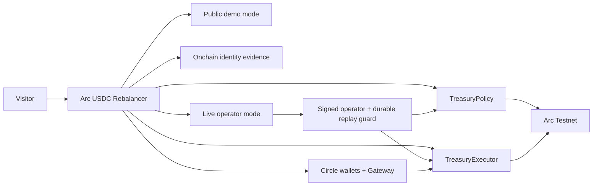

# Arc USDC Rebalancer

A verified Arc Testnet USDC treasury policy workflow with a readiness checker, treasury operations brief, and fail-closed execution controls.

The public demo is report first, execution second: visitors can generate a readiness report without a wallet, compare sample treasury states, copy markdown or an action pack, and only move into operator mode when the operator wallet, live policy, Circle readiness, and executor dependencies are ready.

Live demo: [https://web-eight-chi-99.vercel.app/dashboard](https://web-eight-chi-99.vercel.app/dashboard)
System architecture: [https://web-eight-chi-99.vercel.app/architecture](https://web-eight-chi-99.vercel.app/architecture)
Treasury operations brief: [https://web-eight-chi-99.vercel.app/operator](https://web-eight-chi-99.vercel.app/operator)
Case study: [https://web-eight-chi-99.vercel.app/case-study](https://web-eight-chi-99.vercel.app/case-study)
Hackathon deck: [docs/arc-usdc-rebalancer-defi-treasury-deck.pptx](docs/arc-usdc-rebalancer-defi-treasury-deck.pptx)
Repo: [sin199/arc-usdc-rebalancer](https://github.com/sin199/arc-usdc-rebalancer)
Security model: [docs/security-model.md](./docs/security-model.md)
3-minute demo video: [docs/arc-treasury-agent-demo.mp4](./docs/arc-treasury-agent-demo.mp4)
Submission pack: [docs/arc-architects-submission.md](./docs/arc-architects-submission.md)
Checkpoint 2 progress: [docs/checkpoint-2-progress.md](./docs/checkpoint-2-progress.md)

## What this repo shows

- A public demo mode that visitors can use without a wallet.
- A dedicated treasury operations brief that explains the policy workflow and review path.
- A short case study page that explains what to inspect and how to replay the build.
- A copyable readiness report with policy, balance, Circle, wallet, executor, and onchain identity evidence.
- A copyable action pack with exact commands and payload context for an operator to review.
- A deterministic decision-receipt hash that binds policy source, policy, balance, proposed action, amount, chain, and observation time before any future anchor transaction.
- Live action controls that render only when the deployment flag, allowlisted operator wallet, live policy, Circle readiness, executor, and actionable report state are all ready.
- A dedicated system architecture page with deployment facts, Arcscan links, and current proof status.
- Wallet-signed, allowlisted, amount-capped live requests with durable Redis replay protection, rate-limit, and audit checks; server-signer writes are disabled by default and fail closed without the durable guard.
- Identity activation and Circle wallet creation use the same signed operator authorization boundary as treasury execution.
- A V2 policy/executor reference stack adds onchain policy enforcement, pause, recipient allowlists, two-step ownership transfer, and executor caps without replacing the currently deployed contracts.
- A treasury policy and executor flow on Arc Testnet.
- An Arc-linked onchain identity surfaced as supplementary dashboard evidence.
- Circle developer-controlled wallet and Gateway readiness for USDC routing.
- A single dashboard that ties policy, wallet layer, and execution rail together.

## What it does not do

- It does not silently send transactions.
- It does not execute from preview mode.
- It does not execute unless live writes are explicitly enabled and the connected operator signs an allowlisted, short-lived request.
- It is not a profit bot.

## Why this exists

The repo is built to show a reviewable DeFi Treasury workflow:

1. Read or preview TreasuryPolicy state on Arc Testnet.
2. Preview and simulate treasury scenarios in public demo mode.
3. Surface onchain identity evidence and a treasury brief that recommends the next action.
4. Keep live operator execution gated until all live dependencies are ready.
5. Keep Circle wallets and Gateway visible as part of the same USDC stack.
6. Give reviewers one architecture page with deployment evidence and onchain status.

## Project surface on Arc

The dashboard currently exposes these Arc-specific surfaces:

- Arc Testnet chain state and RPC
- TreasuryPolicy reads and owner-gated updates
- TreasuryExecutor for USDC movement
- Arc-linked onchain identity and validation evidence
- Circle control plane for wallets and Gateway
- Public demo mode for unauthenticated visitors
- Live operator mode for signed execution after readiness gates pass

## Architecture


```mermaid
flowchart LR
  Visitor["Visitor"] --> UI["Arc USDC Rebalancer"]
  UI --> Demo["Public demo mode"]
  UI --> Identity["Onchain identity evidence"]
  UI --> Policy["TreasuryPolicy"]
  UI --> Executor["TreasuryExecutor"]
  UI --> Circle["Circle wallets + Gateway"]
  UI --> Live["Live operator mode"]
  Live --> Guard["Signed operator + durable replay guard"]
  Guard --> Policy
  Guard --> Executor
  Circle --> Executor
  Policy --> Arc["Arc Testnet"]
  Executor --> Arc
```

## Repo layout

- `apps/web` - Next.js dashboard and API routes.
- `packages/contracts` - Solidity contracts and Foundry scripts.
- `packages/shared` - Arc, Circle, policy, and execution helpers.

## Quick start

Install dependencies from the repository root:

```bash
pnpm install
```

Run the frontend:

```bash
pnpm --filter @arc-usdc-rebalancer/web dev
```

Open:

- `http://localhost:3000`
- `http://localhost:3000/dashboard`
- `http://localhost:3000/case-study`

## Reproduce in 3 minutes

1. Open the homepage and confirm the 30-second visitor path: dashboard, readiness report, markdown/action pack, optional operator mode.
2. Open the dashboard and generate a readiness report from the current balance and policy inputs.
3. Switch between below minimum, at target, and above target to confirm `top_up`, `hold`, and `trim` outputs.
4. Copy or download the action pack and confirm its decision receipt is marked `not published`.
5. Confirm live action controls stay hidden until operator wallet, live policy, Circle readiness, executor, and actionable report state are all ready.

## Demo checklist

Use these screenshots to show the public flow without implying live execution:

1. Homepage hero with the 30-second visitor path.
2. Dashboard below minimum, showing a `top_up` readiness report.
3. Dashboard at target, showing a `hold` readiness report.
4. Dashboard above target, showing a `trim` readiness report.
5. Dashboard preview mode with `Execution locked until operator wallet and live dependencies are ready.`

## Reproduce locally in 1 minute

If you just want the app running locally, use the dashboard in preview mode:

```bash
pnpm install
pnpm --filter @arc-usdc-rebalancer/web dev
```

Then open `http://localhost:3000/case-study` first, followed by `http://localhost:3000/dashboard`.

## Arc Testnet details

- Chain ID: `5042002`
- RPC: `https://rpc.testnet.arc.network`
- Explorer: `https://testnet.arcscan.app`
- Native currency: `USDC`
- USDC token address used by the app: `0x3600000000000000000000000000000000000000`

## Environment variables

### Frontend runtime

Copy `apps/web/.env.example` to `apps/web/.env.local` and set:

- `ARC_TESTNET_RPC_URL` - Arc Testnet RPC endpoint used by the frontend
- `TREASURY_POLICY_ADDRESS` - deployed `TreasuryPolicy` contract address
- `TREASURY_EXECUTOR_ADDRESS` - deployed `TreasuryExecutor` contract address
- `NEXT_PUBLIC_EXECUTION_API_URL` - optional legacy execution API base for the job center surface
- `NEXT_PUBLIC_CIRCLE_WALLET_SET_ID` - optional wallet set to surface in the dashboard
- `CIRCLE_API_KEY` - Circle developer API key for server-side wallet operations
- `CIRCLE_ENTITY_SECRET` - Circle entity secret for dev-controlled wallet creation and signing
- `CIRCLE_WALLET_SET_ID` - optional Circle wallet set to reuse for live wallet listing
- `CIRCLE_WALLET_SET_NAME` - wallet set name used when the dashboard creates a new set
- `CIRCLE_WALLET_NAME` - wallet name used when the dashboard creates a new wallet
- `CIRCLE_WALLET_BLOCKCHAIN` - target blockchain for the created wallet, default `ARC-TESTNET`
- `CIRCLE_WALLET_ACCOUNT_TYPE` - `EOA` or `SCA`
- `CIRCLE_GATEWAY_API_BASE` - Gateway API base, default testnet endpoint
- `CIRCLE_GATEWAY_SOURCE_DOMAIN` - Gateway source domain, default `26` for Arc Testnet
- `CIRCLE_GATEWAY_DESTINATION_DOMAIN` - Gateway destination domain, default `6` for Base Sepolia
- `OWNER_PRIVATE_KEY` - Arc Testnet agent owner wallet key used by the activation route
- `VALIDATOR_PRIVATE_KEY` - Arc Testnet validator wallet key used by the activation route
- `ENABLE_LIVE_EXECUTION` - legacy server-signer writes remain hard-disabled; this flag cannot bypass the reviewed V2 execution gate
- `LIVE_EXECUTION_OPERATOR_ALLOWLIST` - comma-separated wallet addresses allowed to authorize writes
- `LIVE_EXECUTION_ALLOWED_ORIGINS` - comma-separated browser origins allowed to submit signed writes
- `LIVE_EXECUTION_MAX_AMOUNT_USDC` - per-request amount ceiling, default `200`
- `LIVE_EXECUTION_RATE_LIMIT_PER_MINUTE` - best-effort per-operator instance limit, default `3`
- `LIVE_EXECUTION_SIGNATURE_TTL_SECONDS` - signed request lifetime, default `60`
- `UPSTASH_REDIS_REST_URL` / `UPSTASH_REDIS_REST_TOKEN` - required durable Redis state for cross-instance replay and rate-limit protection
- `LIVE_EXECUTION_REDIS_NAMESPACE` - optional Redis key namespace
- `LIVE_EXECUTION_ALLOW_IN_MEMORY_GUARD` - explicit local-development fallback only; ignored as a production readiness substitute

### Worker API

- `WORKER_API_TOKEN` - required Bearer token for every Worker `POST` endpoint; the Worker refuses mutation requests when it is missing
- `WORKER_ALLOWED_ORIGINS` - optional comma-separated browser origins; cross-origin requests are rejected unless explicitly listed
- `WORKER_MAX_BODY_BYTES` - maximum JSON request size, default `65536` and capped at `1048576`

### Contract deployment

Copy `packages/contracts/.env.example` to `packages/contracts/.env` and set:

- `ARC_TESTNET_RPC_URL`
- `PRIVATE_KEY`
- `MIN_THRESHOLD_USDC`
- `TARGET_BALANCE_USDC`
- `MAX_REBALANCE_AMOUNT_USDC`
- `EXECUTOR_MAX_AMOUNT_USDC` - V2 executor-level cap, expressed in whole USDC before the deploy script converts to 6 decimals

## Circle bootstrap

If you need to create a fresh Circle developer secret and wallet set, run:

```bash
pnpm circle:bootstrap
```

The command generates a new entity secret, registers it with Circle, creates an Arc Testnet wallet set, and provisions one developer-controlled wallet.

## Deployment

Frontend deployment is Vercel-based and should use `apps/web` as the project root.

The contract package is separate and can be deployed independently from the frontend.

`pnpm contracts:deploy-v2` prepares a new V2 policy/executor stack. Do not run it until the initial owner/multisig and migration plan have been reviewed.

`forge script script/DeployTreasuryDecisionReceipt.s.sol:DeployTreasuryDecisionReceipt --rpc-url $ARC_TESTNET_RPC_URL --broadcast --private-key $PRIVATE_KEY` deploys an optional receipt registry. It records reviewed decision hashes only and cannot custody or move USDC. Do not run it until the owner and public proof plan have been reviewed.

## Review path

If you are reviewing this repo, start here:

1. Open the system architecture at [web-eight-chi-99.vercel.app/architecture](https://web-eight-chi-99.vercel.app/architecture).
2. Open the live checker at [web-eight-chi-99.vercel.app/dashboard](https://web-eight-chi-99.vercel.app/dashboard).
3. Generate a report, copy the action pack, and compare the sample scenarios.
4. Confirm preview mode shows the locked execution state instead of runnable live controls.
5. Open the treasury operations brief at [web-eight-chi-99.vercel.app/operator](https://web-eight-chi-99.vercel.app/operator).
6. Open the case study at [web-eight-chi-99.vercel.app/case-study](https://web-eight-chi-99.vercel.app/case-study).
7. Read the release notes and this README before judging the demo.

## Notes

- The dashboard reads and writes the deployed contract on Arc Testnet only.
- Public visitors can explore the demo without a wallet.
- Preview mode is for reports and copyable action packs, not live transaction submission.
- Live signing stays disabled by default and requires a fresh allowlisted operator wallet signature when enabled.
- Product funnel events are privacy-safe and exclude wallet addresses; they are emitted as structured server logs.
- The Circle line is the live control plane for wallets and Gateway, not a separate product.
- The Arc agent panel surfaces the onchain identity and validation state tied to this website.
- The brief panel turns the current state into a single recommended action.
