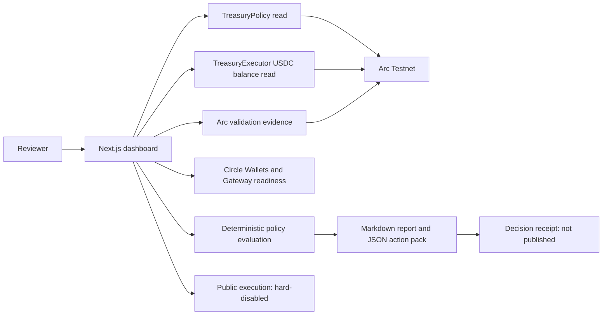

# Arc USDC Rebalancer

Arc USDC Rebalancer is a deployed Arc Testnet DeFi treasury decision MVP. It
turns live Arc and Circle readiness signals into a bounded `top_up`, `hold`, or
`trim` recommendation and an auditable action pack.

The public deployment is intentionally read-only. It exposes no wallet or
signing interface, submits no treasury transaction, and never presents a
decision receipt as an onchain confirmation.

## Public artifacts

- [Live dashboard](https://web-eight-chi-99.vercel.app/dashboard)
- [Watch the three-minute demo](https://web-eight-chi-99.vercel.app/demo)
- [System architecture](https://web-eight-chi-99.vercel.app/architecture)
- [Treasury operations brief](https://web-eight-chi-99.vercel.app/operator)
- [Reproducible case study](https://web-eight-chi-99.vercel.app/case-study)
- [Three-minute demo MP4](./docs/arc-treasury-agent-demo.mp4)
- [DeFi Track deck PDF](./docs/arc-usdc-rebalancer-defi-treasury-deck.pdf)
- [Editable DeFi Track deck](./docs/arc-usdc-rebalancer-defi-treasury-deck.pptx)
- [Final submission pack](./docs/final-submission.md)
- [Security model](./docs/security-model.md)

## Why this is a DeFi project

Treasury operators need an auditable answer before moving stablecoins:

- Is the executor balance below the policy minimum?
- Is the balance already inside the allowed band?
- Is it above the target?
- Which evidence supports the recommendation?
- Is the public execution boundary still locked?

Treasury infrastructure using Arc and USDC is an explicit DeFi Track use case.
This project does not claim Agentic Economy Track eligibility or autonomous
custody.

## What works today

- Reads the deployed TreasuryPolicy from Arc Testnet.
- Reads the configured TreasuryExecutor USDC balance.
- Surfaces Arc-linked validation as supplementary evidence.
- Checks Circle developer-controlled Wallets and Gateway readiness.
- Evaluates deterministic, policy-bounded `top_up`, `hold`, and `trim`
  outcomes.
- Exports a Markdown report and JSON action pack.
- Marks local decision receipts `not published`.
- Provides a reproducible case study covering 1,003 balance cases, 100%
  expected-action agreement, 9/9 safety gates, and zero submitted
  transactions.

## Public safety boundary

- `GET /api/treasury/execution/status` reports `enabled: false`.
- The legacy executor is not wired into the submitted public path.
- No environment flag can enable that legacy path.
- The dashboard exposes no wallet connection or signing control.
- Mutation requests to the public treasury execution route fail closed.
- Worker jobs are simulations and do not fabricate transaction hashes or
  Arcscan confirmations.

The Solidity execution code remains in the repository for review, but it is
not reachable from the public deployment.

## Architecture


```mermaid
flowchart LR
  Visitor["Reviewer"] --> Web["Next.js dashboard"]
  Web --> Policy["TreasuryPolicy read"]
  Web --> Balance["TreasuryExecutor USDC balance read"]
  Web --> Validation["Arc validation evidence"]
  Web --> Circle["Circle Wallets and Gateway readiness"]
  Policy --> Arc["Arc Testnet"]
  Balance --> Arc
  Validation --> Arc
  Web --> Decision["Deterministic policy evaluation"]
  Decision --> Report["Markdown report and JSON action pack"]
  Report --> Receipt["Decision receipt: not published"]
  Web --> Locked["Public execution: hard-disabled"]
```

## Review in three minutes

1. Open the [dashboard](https://web-eight-chi-99.vercel.app/dashboard).
2. Inspect the live Arc policy, executor balance, validation, and Circle
   readiness.
3. Set the scenario below the minimum and confirm a bounded `top_up`.
4. Set it inside the policy band and confirm `hold`.
5. Set it above the target and confirm a bounded `trim`.
6. Copy the action pack and confirm that its receipt is marked
   `not published`.
7. Confirm that the UI says `Execution locked`, exposes no wallet control, and
   submits no transaction.

## Repository layout

- `apps/web` - Next.js dashboard and server routes
- `apps/worker` - authenticated local simulation worker
- `packages/contracts` - Foundry contracts, deployment scripts, and tests
- `packages/shared` - shared Arc, Circle, policy, and amount helpers
- `docs` - submission copy, evidence, deck, video, and security model

## Run locally

Requirements:

- Node.js 22 or newer
- pnpm 10
- Foundry for contract builds and tests

Install dependencies:

```bash
pnpm install
```

Copy `apps/web/.env.example` to `apps/web/.env.local`, then start the web app:

```bash
pnpm dev
```

Open:

- `http://localhost:3000`
- `http://localhost:3000/dashboard`
- `http://localhost:3000/demo`
- `http://localhost:3000/architecture`
- `http://localhost:3000/case-study`

The dashboard remains useful in preview mode when live configuration is
missing. Missing reads degrade to a labeled safe result rather than unlocking
execution.

## Arc Testnet configuration

- Chain ID: `5042002`
- RPC: `https://rpc.testnet.arc.network`
- Explorer: `https://testnet.arcscan.app`
- Native currency: `USDC`
- USDC address: `0x3600000000000000000000000000000000000000`
- TreasuryPolicy: `0x4bFa1e67B1163B452d39f27F799B0A7D28F545f6`
- TreasuryExecutor: `0x5c5d0275371724779f3a6928eb0312df2b1a501f`

Runtime configuration is documented in:

- [`apps/web/.env.example`](./apps/web/.env.example)
- [`apps/worker/.env.example`](./apps/worker/.env.example)
- [`packages/contracts/.env.example`](./packages/contracts/.env.example)

Never commit private keys, Circle credentials, worker bearer tokens, or Redis
credentials.

## Circle bootstrap

To create a development Circle wallet set for local testing:

```bash
pnpm circle:bootstrap
```

This command uses server-side credentials. It is not required to inspect the
public read-only dashboard.

## Verification

Web:

```bash
pnpm lint
pnpm typecheck
pnpm --filter @arc-usdc-rebalancer/web test
pnpm build
```

Worker:

```bash
pnpm worker:typecheck
pnpm worker:test
pnpm worker:build
```

Contracts:

```bash
pnpm contracts:build
pnpm contracts:test
```

The GitHub Actions `Verify` workflow runs these checks on pushes and pull
requests to `main`.

## Contract deployment warning

`pnpm contracts:deploy-v2` prepares a new V2 policy and executor stack. Do not
broadcast it without a reviewed owner or multisig migration plan.

The optional decision-receipt registry records reviewed hashes only; it cannot
custody or move USDC. It is not deployed as part of the submitted public
evidence.

## Evidence boundary

The submission proves a functional read, evaluate, and report workflow on Arc
Testnet. It does not claim:

- a completed treasury transfer;
- autonomous custody;
- a confirmed Arc transaction;
- a published onchain decision receipt;
- Agentic Economy Track compliance.
